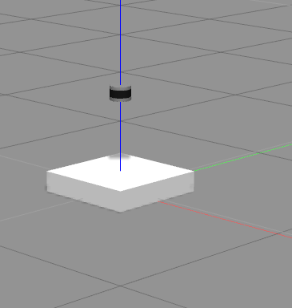

LiDAR
======

To check the LiDAR model:
::

  roslaunch mavs_description lidar_example.launch

Which should look something like:

Check out the topics, ``rostopic list`` should produce something like:
::

  /clock
  /gazebo/link_states
  /gazebo/model_states
  /gazebo/parameter_descriptions
  /gazebo/parameter_updates
  /gazebo/set_link_state
  /gazebo/set_model_state
  /joint_states
  /rosout
  /rosout_agg
  /tf
  /tf_static
  /velodyne_points

Then open up another terminal and move the LiDAR model:
::

  rostopic pub -r 20 /gazebo/set_model_state gazebo_msgs/ModelState '{model_name: coke_can, pose: { position: { x: 1, y: 0, z: 2 }, orientation: {x: 0, y: 0.491983115673, z: 0, w: 0.870604813099 } }, twist: { linear: { x: 0, y: 0, z: 0 }, angular: { x: 0, y: 0, z: 0}  }, reference_frame: world }'
