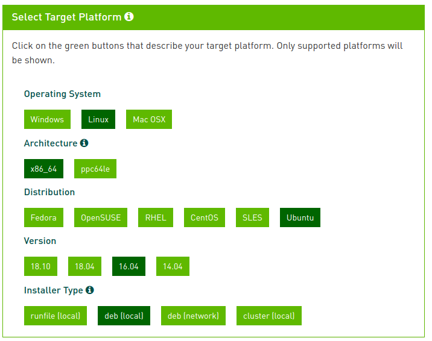
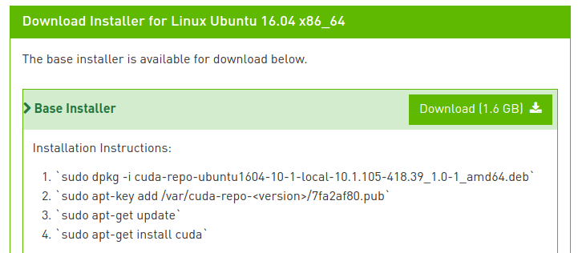

# Michigan Autonomous Vehicles
This software simulates autonomous vehicles within a ROS environment.

## Documentation
[**STABLE**](https://juliampc.github.io/MAVs/stable/) &mdash; **most recently tagged version of the documentation.**

[**LATEST**](https://juliampc.github.io/MAVs/latest/) &mdash; **in-development version of the documentation.**

## Installation Instructions

These instructions depend on your machine's configuration.

### Step 1, Install Docker

Remove any old versions of docker *if* they are on your machine:
```
sudo apt-get remove docker docker-engine docker.io
```

Update the apt package index:
```
sudo apt-get update
```

Install the packages to allow apt to use a repository through HTTPS:
```
sudo apt-get install \
   apt-transport-https \
   ca-certificates \
   curl \
   software-properties-common
```

Add the official GPG key of Docker:
```
curl -fsSL https://download.docker.com/linux/ubuntu/gpg | sudo apt-key add -
```

Verify that the command below print out 9DC8 5822 9FC7 DD38 854A E2D8 8D81 803C 0EBF CD88:
```
sudo apt-key fingerprint 0EBFCD88
```

Tell apt to use the stable repository by running the command below:
```
sudo add-apt-repository \
   "deb [arch=amd64] https://download.docker.com/linux/ubuntu \
   $(lsb_release -cs) \
   stable"
```

Update the apt package index and install Docker CE:
```
sudo apt-get update && apt-get install docker-ce
```

Check installation of docker:
```
docker run hello-world
```


### Step 2, Update NVIDIA Driver

Use the [CUDA 10.1 Toolkit](https://developer.nvidia.com/cuda-downloads
) to install CUDA. An example of using this toolkit follows.






After the download is complete, cd into your ``~\Downloads`` folder and follow the installation instructions provided by the toolkit to install CUDA:
```
sudo dpkg -i $HOME/Downloads/cuda-repo-ubuntu1604-10-1-local-10.1.105-418.39_1.0-1_amd64.deb
sudo apt-key add /var/cuda-repo-<version>/7fa2af80.pub
sudo apt-get update
sudo apt-get install cuda
```

*Note:* After you follow the first instruction, the `<version>` in the second instruction will be provided. For instance, in this example:
```
$HOME/Downloads/cuda-repo-ubuntu1604-10-1-local-10.1.105-418.39_1.0-1_amd64.deb
```
Produces:
```
Selecting previously unselected package cuda-repo-ubuntu1604-10-1-local-10.1.105-418.39.
(Reading database ... 551128 files and directories currently installed.)
Preparing to unpack .../cuda-repo-ubuntu1604-10-1-local-10.1.105-418.39_1.0-1_amd64.deb ...
Unpacking cuda-repo-ubuntu1604-10-1-local-10.1.105-418.39 (1.0-1) ...
Setting up cuda-repo-ubuntu1604-10-1-local-10.1.105-418.39 (1.0-1) ...

The public CUDA GPG key does not appear to be installed.
To install the key, run this command:
sudo apt-key add /var/cuda-repo-10-1-local-10.1.105-418.39/7fa2af80.pub
```
Thus add the key as instructed, before proceeding with the final instructions.


*Reboot your computer and verify that the NVIDIA graphics driver can be loaded*
```
nvidia-smi
```
which should produce something like this
```
Mon Jun 10 08:59:09 2019       
+-----------------------------------------------------------------------------+
| NVIDIA-SMI 418.67       Driver Version: 418.67       CUDA Version: 10.1     |
|-------------------------------+----------------------+----------------------+
| GPU  Name        Persistence-M| Bus-Id        Disp.A | Volatile Uncorr. ECC |
| Fan  Temp  Perf  Pwr:Usage/Cap|         Memory-Usage | GPU-Util  Compute M. |
|===============================+======================+======================|
|   0  GeForce GTX TITAN   On   | 00000000:03:00.0  On |                  N/A |
| 34%   50C    P8    17W / 250W |    433MiB /  6080MiB |      0%      Default |
+-------------------------------+----------------------+----------------------+
                                                                               
+-----------------------------------------------------------------------------+
| Processes:                                                       GPU Memory |
|  GPU       PID   Type   Process name                             Usage      |
|=============================================================================|
|    0      1895      G   /usr/lib/xorg/Xorg                            27MiB |
|    0      1965      G   /usr/bin/gnome-shell                          49MiB |
|    0      2943      G   /usr/lib/xorg/Xorg                           177MiB |
|    0      3103      G   /usr/bin/gnome-shell                          97MiB |
|    0      3511      G   ...uest-channel-token=13252725915974596027    76MiB |
+-----------------------------------------------------------------------------+
```
### Step 3, [Install NVIDIA-docker](https://chunml.github.io/ChunML.github.io/project/Installing-NVIDIA-Docker-On-Ubuntu-16.04/)
*If* installed, remove NVIDIA docker 1.0:
```
docker volume ls -q -f driver=nvidia-docker | xargs -r -I{} -n1 docker ps -q -a -f volume={} | xargs -r docker rm -f
sudo apt-get purge -y nvidia-docker
```

Add the necessary repositories and update the apt package index and Install NVIDIA docker:
```
curl -s -L https://nvidia.github.io/nvidia-docker/gpgkey | sudo apt-key add - && \
distribution=$(. /etc/os-release;echo $ID$VERSION_ID) && \
curl -s -L https://nvidia.github.io/nvidia-docker/$distribution/nvidia-docker.list | sudo tee /etc/apt/sources.list.d/nvidia-docker.list && \
sudo apt-get update && \
sudo apt-get install -y nvidia-docker2 && \
sudo pkill -SIGHUP dockerd
```


Test NVIDIA docker installation:
```
docker run --runtime=nvidia --rm nvidia/cuda nvidia-smi
```


### Step 4, Install MAVs

1. Make a directory to store MAVs in, e.g., ``$HOME/Documents/workspace/MAVs``. cd into that directory.

2. Clone the `develop` branch of the repository
```
git clone -b develop https://github.com/JuliaMPC/MAVs
```

3. Build image
```
sh build.sh
```

4. Test MAVs

First start Docker container in the MAVs folder:
```
./run.sh
```

Then, the most basic usage of MAVs is simply running the demos. For instance, demoA can be run as:
```
$roslaunch system demoA.launch
```


## Tests
Unfortunately this software stack exceeds the time limit on Docker as well as Travis services (~45 min). So, while these services are configured, they cannot be utilized.   
[Docker Hub repo](https://hub.docker.com/r/avpg/mavs/) 

[](https://travis-ci.org/JuliaMPC/MAVs)

[](https://juliampc.github.io/AVExamples.jl/stable/)
[](https://juliampc.github.io/AVExamples.jl/latest/)
