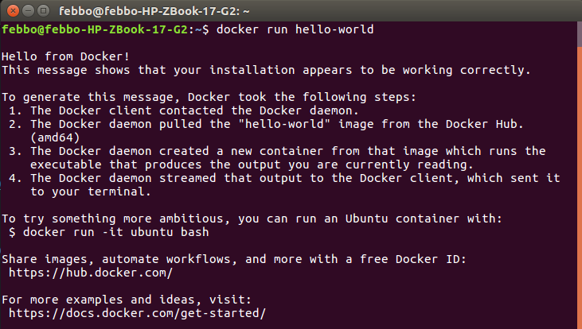
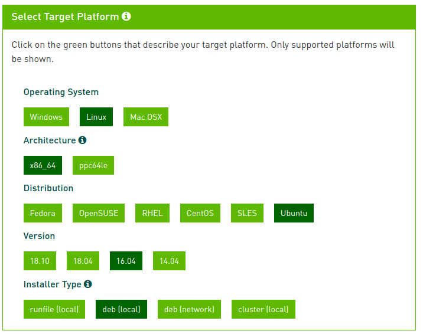
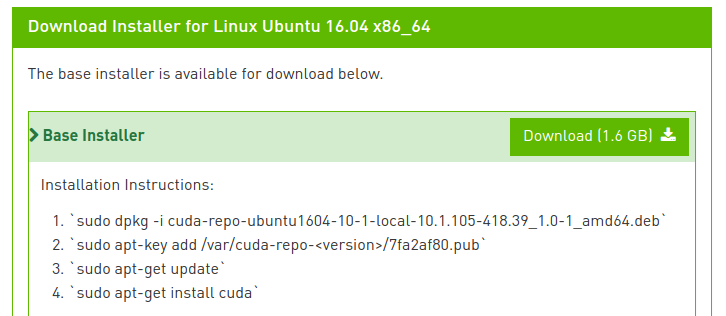
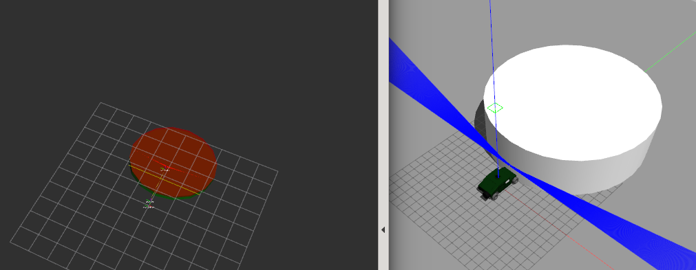

# MAVs Documentation
This software simulates an autonomous vehicle within a ROS environment.

## Features
* nonlinear model predictive control through [NLOptControl.jl](https://github.com/JuliaMPC/NLOptControl.jl)
* lidar simulation through Gazebo
* vehicle model through Chrono

## Installation Instructions

These instructions depend on your machine's configuration.

### Step 1, Install Docker

Remove any old versions of docker *if* they are on your machine:
```
sudo apt-get remove docker docker-engine docker.io
```

Update the apt package index:
```
sudo apt-get update
```

Install the packages to allow apt to use a repository through HTTPS:
```
sudo apt-get install \
   apt-transport-https \
   ca-certificates \
   curl \
   software-properties-common
```

Add the official GPG key of Docker:
```
curl -fsSL https://download.docker.com/linux/ubuntu/gpg | sudo apt-key add -
```

Verify that the command below print out 9DC8 5822 9FC7 DD38 854A E2D8 8D81 803C 0EBF CD88:
```
sudo apt-key fingerprint 0EBFCD88
```

Tell apt to use the stable repository by running the command below:
```
sudo add-apt-repository \
   "deb [arch=amd64] https://download.docker.com/linux/ubuntu \
   $(lsb_release -cs) \
   stable"
```

Update the apt package index and install Docker CE:
```
sudo apt-get update && apt-get install docker-ce
```

Check installation of docker:
```
docker run hello-world
```



### Step 2, Update NVIDIA Driver

Use the [CUDA 10.1 Toolkit](https://developer.nvidia.com/cuda-downloads
) to install CUDA. An example of using this toolkit follows.






After the download is complete, cd into your ``~\Downloads`` folder and follow the installation instructions provided by the toolkit to install CUDA:
```
sudo dpkg -i $HOME/Downloads/cuda-repo-ubuntu1604-10-1-local-10.1.105-418.39_1.0-1_amd64.deb
sudo apt-key add /var/cuda-repo-<version>/7fa2af80.pub
sudo apt-get update
sudo apt-get install cuda
```

*Note:* After you follow the first instruction, the `<version>` in the second instruction will be provided. For instance, in this example:
```
$HOME/Downloads/cuda-repo-ubuntu1604-10-1-local-10.1.105-418.39_1.0-1_amd64.deb
```
Produces:
```
Selecting previously unselected package cuda-repo-ubuntu1604-10-1-local-10.1.105-418.39.
(Reading database ... 551128 files and directories currently installed.)
Preparing to unpack .../cuda-repo-ubuntu1604-10-1-local-10.1.105-418.39_1.0-1_amd64.deb ...
Unpacking cuda-repo-ubuntu1604-10-1-local-10.1.105-418.39 (1.0-1) ...
Setting up cuda-repo-ubuntu1604-10-1-local-10.1.105-418.39 (1.0-1) ...

The public CUDA GPG key does not appear to be installed.
To install the key, run this command:
sudo apt-key add /var/cuda-repo-10-1-local-10.1.105-418.39/7fa2af80.pub
```
Thus add the key as instructed, before proceeding with the final instructions.


*Reboot your computer and verify that the NVIDIA graphics driver can be loaded*


### Step 3, [Install NVIDIA-docker](https://chunml.github.io/ChunML.github.io/project/Installing-NVIDIA-Docker-On-Ubuntu-16.04/
)

*If* installed, remove NVIDIA docker 1.0:
```
docker volume ls -q -f driver=nvidia-docker | xargs -r -I{} -n1 docker ps -q -a -f volume={} | xargs -r docker rm -f
sudo apt-get purge -y nvidia-docker
```

Add the necessary repositories and update the apt package index:
```
curl -s -L https://nvidia.github.io/nvidia-docker/gpgkey | \
  sudo apt-key add -
curl -s -L https://nvidia.github.io/nvidia-docker/ubuntu16.04/amd64/nvidia-docker.list | \
  sudo tee /etc/apt/sources.list.d/nvidia-docker.list
sudo apt-get update
```

Install NVIDIA docker:
```
sudo apt-get install -y nvidia-docker2
sudo pkill -SIGHUP dockerd
```

Test NVIDIA docker installation:
```
docker run --runtime=nvidia --rm nvidia/cuda nvidia-smi
```


### Step 4, Install MAVs

1. Make a directory to store MAVs in, e.g., ``$HOME/Documents/workspace/MAVs``. cd into that directory.

2. Clone the `develop` branch of the repository
```
git clone -b develop https://github.com/JuliaMPC/MAVs
```

3. Build image
```
sh build.sh
```

4. Test MAVs

First start Docker container in the MAVs folder:
```
./run.sh
```

Then, the most basic usage of MAVs is simply running the demos. For instance, demoA can be run as:
```
$roslaunch system demoA.launch
```


#### Potential Issue, NVIDIA driver is too old for CUDA 10

If you try to run the test:
```
$ docker run --runtime=nvidia --rm nvidia/cuda nvidia-smi
```

And get this error:
```
Unable to find image 'nvidia/cuda:latest' locally
latest: Pulling from nvidia/cuda
898c46f3b1a1: Pull complete
63366dfa0a50: Pull complete
041d4cd74a92: Pull complete
6e1bee0f8701: Pull complete
131dbe7c254d: Pull complete
5bca6b05dcd6: Pull complete
0d286a7b6e12: Pull complete
5776d2c6371d: Pull complete
768e84e7fc24: Pull complete
Digest: sha256:eba1dc5810e40f60625ee797d618a6bd11be24cb67bc6647a4d36392202bb013
Status: Downloaded newer image for nvidia/cuda:latest
docker: Error response from daemon: OCI runtime create failed: container_linux.go:345: starting container process caused "process_linux.go:424: container init caused \"process_linux.go:407: running prestart hook 1 caused \\\"error running hook: exit status 1, stdout: , stderr: exec command: [/usr/bin/nvidia-container-cli --load-kmods configure --ldconfig=@/sbin/ldconfig.real --device=all --compute --utility --require=cuda>=10.1 brand=tesla,driver>=384,driver<385 brand=tesla,driver>=410,driver<411 --pid=25518 /var/lib/docker/overlay2/daf8349b9ffd92c040ff872e037e3afa56b93a5abeb6f2406e42fa596a88facf/merged]\\\\nnvidia-container-cli: requirement error: unsatisfied condition: brand = tesla\\\\n\\\"\"": unknown.
```
*Did you follow Step 2?*

Because it is likely that your nvidia driver is too old to support CUDA 10 [see NVidia's compatibility table](https://docs.nvidia.com/deploy/cuda-compatibility/index.html#binary-compatibility__table-toolkit-driver).


To check your NVIDIA driver version:
```
$ nvidia-smi
```

```
Sun Apr 14 09:10:14 2019       
+-----------------------------------------------------------------------------+
| NVIDIA-SMI 384.130                Driver Version: 384.130                   |
|-------------------------------+----------------------+----------------------+
| GPU  Name        Persistence-M| Bus-Id        Disp.A | Volatile Uncorr. ECC |
| Fan  Temp  Perf  Pwr:Usage/Cap|         Memory-Usage | GPU-Util  Compute M. |
|===============================+======================+======================|
|   0  Quadro K2200M       Off  | 00000000:01:00.0  On |                  N/A |
| N/A   45C    P8    N/A /  N/A |    437MiB /  1999MiB |      1%      Default |
+-------------------------------+----------------------+----------------------+

+-----------------------------------------------------------------------------+
| Processes:                                                       GPU Memory |
|  GPU       PID   Type   Process name                             Usage      |
|=============================================================================|
|    0      1385      G   /usr/lib/xorg/Xorg                           189MiB |
|    0      2693      G   compiz                                        86MiB |
|    0      3162      G   ...-token=8169387D71BE805A200B4A3744EC138E    94MiB |
|    0      6728      G   ...passed-by-fd --v8-snapshot-passed-by-fd    62MiB |
+-----------------------------------------------------------------------------+
```

If that's the case, you can either use one of the numbered 1.12 tags or upgrade your device driver to a version that supports CUDA 10. Try using using the [CUDA 10.1 Toolkit](https://developer.nvidia.com/cuda-downloads
) to install CUDA (i.e., *Step 2*)

## Citation
If you find [NLOptControl.jl](https://github.com/JuliaMPC/NLOptControl.jl) useful, please cite it:
```
@software{nlopt,
  author = {{Huckleberry Febbo}},
  title = {NLOptControl.jl},
  url = {https://github.com/JuliaMPC/NLOptControl.jl},
  version = {0.0.1},
  date = {2017-06-17},
}
```

If you find [VehicleModels.jl](https://github.com/JuliaMPC/VehicleModels.jl) useful, please cite this paper:
```
@Conference{Febbo2017,
  author    = {Huckleberry Febbo, Jiechao Liu, Paramsothy Jayakumar, Jeffrey L. Stein, Tulga Ersal},
  title     = {Moving Obstacle Avoidance for Large, High-Speed Autonomous Ground Vehicles},
  year      = {2017},
  publisher = {IEEE}
}
```
