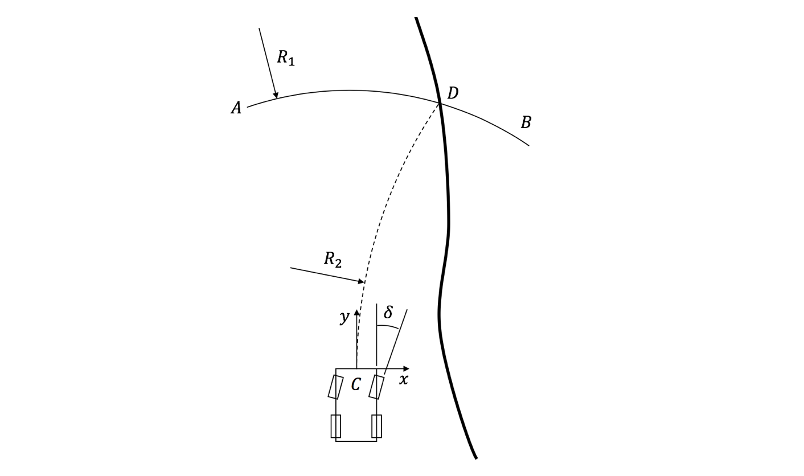
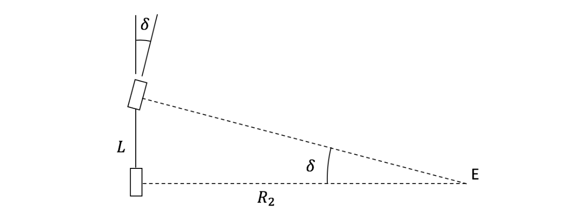

# path_follower

The path_follower package is to control the vehicle using Pure Pursuit (PP) controller. The logic is described as follows.

## Inputs

Following are the arguments are required by `path_follower.launch` package

#### Vehicle State

Name | Description
--- | ---
`/state/x`| global x position (m)
`/state/y`| global y position (m)
`/state/psi`| global heading angle (rad)
`/state/ux`| velocity in the x direction (vehicle frame) in (m/s)

#### Trajectories

Name | Description
--- | ---
`/trajectory/x`| global x position trajectory (m)
`/trajectory/y`| global y position trajectory (m)

## Output

The output of this package is the steering angle only.

#### Vehicle State

Name | Description
--- | ---
`/state/sa`| steering angle at the tire (rad)

## Logic

The Logic of the Pure Pursuit (PP) controller is shown in the figure below.

When a path is given to the vehicle to follow, we will first draw an arc 
 AB with radius R_1, and the center of the arc is the vehicle itself. R_1 can is chosen to be proportional to the vehicle speed, R_1=Kv, with saturation R_max and R_min to avoid the case of no solution.
Then, find the intersection (point D) between arc AB and the planned path, and express the position of point D as (x_D, y_D) using the vehicle coordinate system. Point D is the position where the vehicle wants to arrive next.
To command the vehicle to head towards point D, we fit another arc CD which passes through the current vehicle position (0, 0) and (x_D, y_D), and the direction of the arc at (0, 0) is straight up. The radius of the arc CD is R_2, which is also the radius of curvature of the real vehicle path. Then, the relationship between R2 and (x_D, y_D) can be expressed as

Then we have

The radius of curvature R_2 is closely related to the steering angle as shown in the figure below. Point E is the instantaneous rotation center of the vehicle. 

Finally, assume there is no slip between tires and the ground. The relationship between the steering angle and the radius of curvature R_2 is

Where L is the wheelbase.
