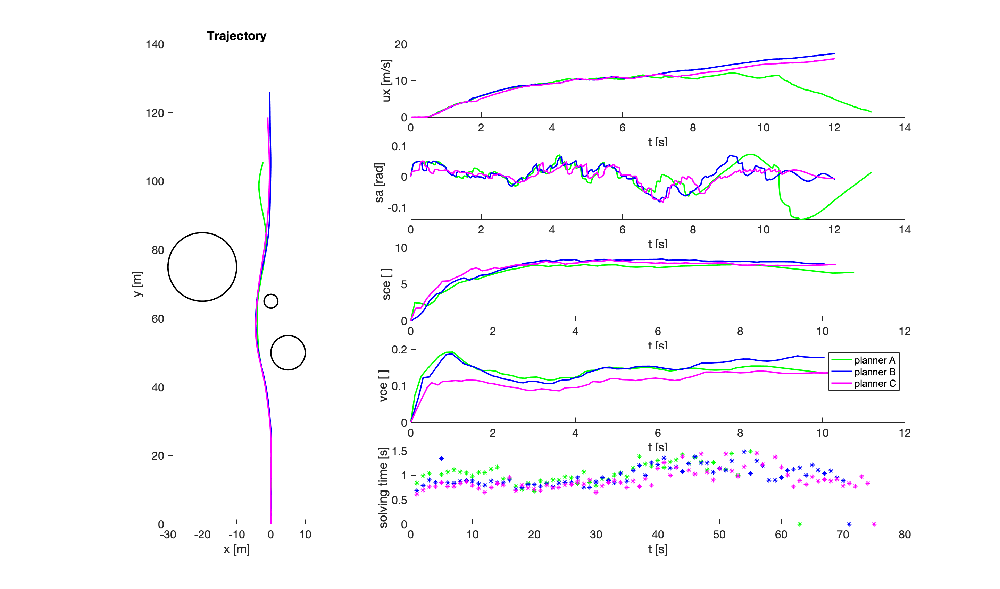

# demoI

In this demo, the vehicle follows a path autonomously, which is generated by `nloptcontrol_planner` and helps the vehicle to avoid obstacles. The obstacles are assumed to be known which means its position's information is directly known by the `nloptcontrol_planner`. The motion controller used in this demo is Trajectory Follower which is based on the PID.
This demo utilizes the command `x`, `y`, `ux` from `nloptcontrol_planner`.
  
## To Run
```
roslaunch system demoI.launch
```

## Expected Output
First figure shows the ui for demoI, where `Running model for the: xxx time` shows the current step time. 


For the numeric results, if you run demoI with case 3 and planner A, B and C, you should expect the reuslts shown in the following figure. In this figure, the black circle shows the 2D geometry of obstacle. The right five figures show velocity, steering angle, velocity control effort, steering control effort and solving time. The solve time depends on the hardware so the real one may different from the one we shown below.



Second figure shows the topic maps for demo I where we can see `nlopcontrol_planner/control` communicate with `/obstacle_avoidance` and `\path`


