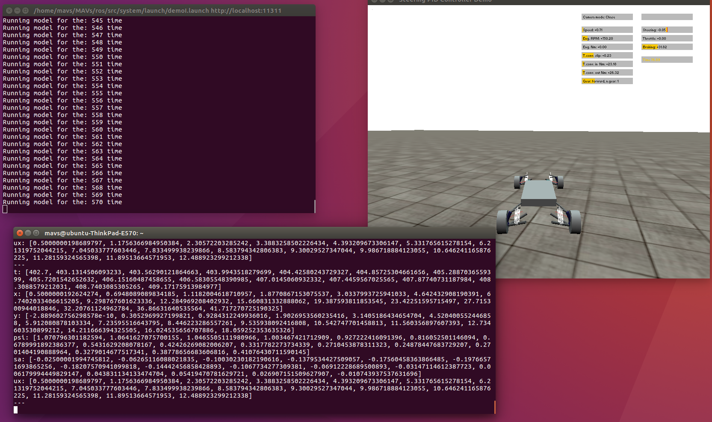
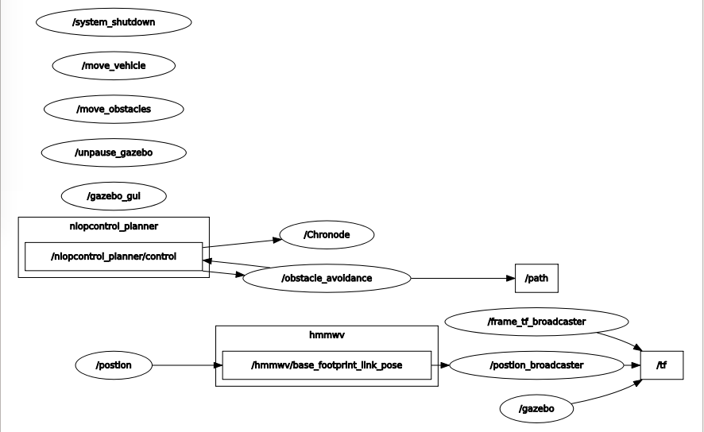

# demoI

## `nloptcontrol_planner` is used to generate a path which avoids all the obstacles and give a optimal trajectory. Then the generated trajectory will be passed to `chronode`, and vehicle will follow the trajectory by `/trajectory/sa` and `/trajectory/ux` in chrono environment. 
  
## To Run
```
roslaunch system demoI.launch
```

## Expected Output
First figure shows the ui for demoI, where `Running model for the: xxx time` shows the current step time. 

Second figure shows the topic maps for demo I where we can see `nlopcontrol_planner/control` communicate with `/obstacle_avoidance` and `\path`



