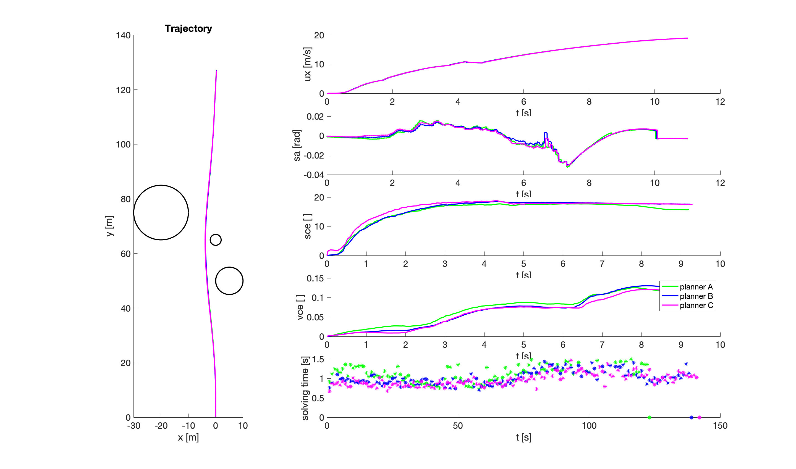

# demoK

In this demo, the vehicle follows a path autonomously, which is generated by `nloptcontrol_planner` and helps the vehicle to avoid obstacles. The obstacles are assumed to be known which means its position's information is directly known by the `nloptcontrol_planner`. The motion controller used in this demo is Path Follower which is based on the Pure Pursuit.
This demo utilizes the command `x`, `y`, `ux` from `nloptcontrol_planner`.
  
## To Run

```
$ roslaunch system demoK.launch
```

This may take a long time to initialize.

## Expected Output
The output of this demo should be similar to the figure below. `Running model for the: xxx time` shows the current step time. 


For the numeric results, if you run demoK with case 3 and planner A, B and C, you should expect the reuslts shown in the following figure. In this figure, the black circle shows the 2D geometry of obstacle. The right five figures show velocity, steering angle, velocity control effort, steering control effort and solving time. The solve time depends on the hardware so the real one may different from the one we shown below.



The relationship between different topics/topics is checked by opening a new terminal, and enter the docker by

```
$ docker exec -it <container_name> /bin/bash
```

`<container_name>` can be auto filled by the `Tab` key. Then, open the rqt graph by

```
$ rqt_graph
```

The output of `rqt_graph` is shown below. `nlopcontrol_planner/control` communicates with `/obstacle_avoidance`.


